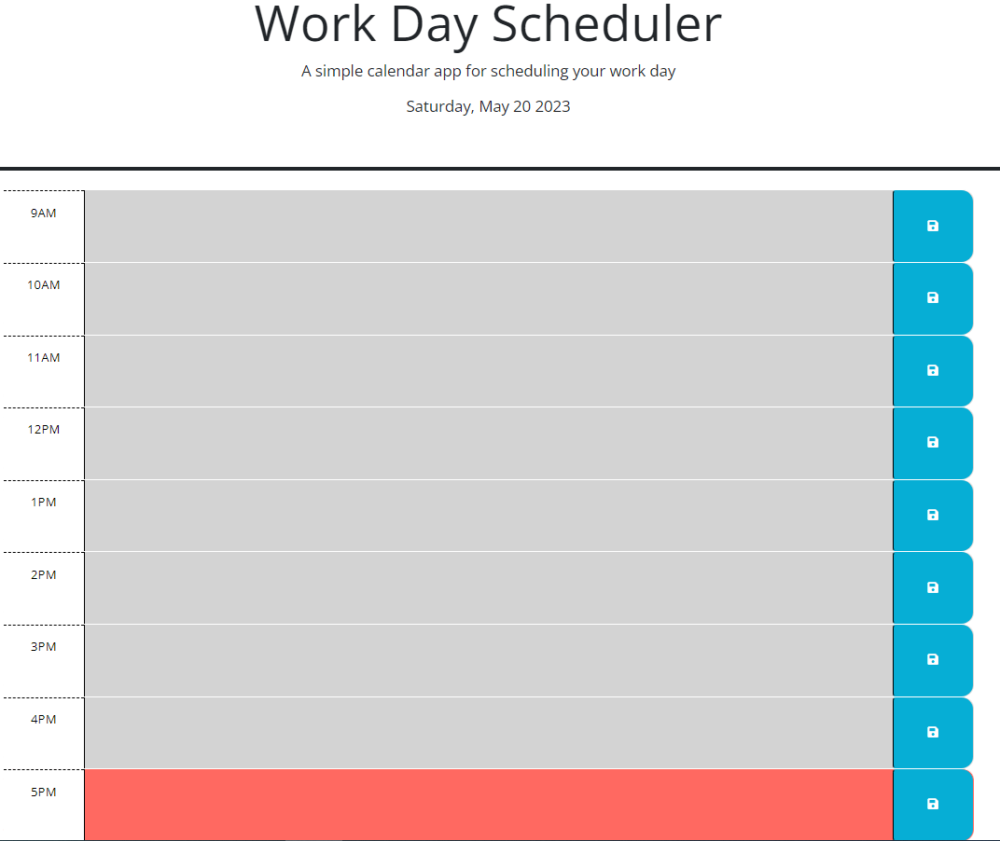

# Day Scheduler Challenge 5

## Challenge Goals

The goal of this challenge is to use jQuery and the Day.js library to create a calendar application that allows the user to save events for each hour of the day.

## Tools Used

* VSS
* Git
* Git Hub
* Dev Tools
* jQuery
* Day.js

## Repairs and Modifications

* Current day is displayed at the top of the calendar
* Added timeblocks for standard business hours
* Apply a color change for past, present and future timeblocks
* Add events by typing in timeblock
* Items are set into local storage using the Save Button
* Stored tasks will display when user opens app

## What I Learned

I learned how to utilize jQuery and Day.js to create a dynamic, yet simple, day scheduler application.

## Link and Screenshot

[Day Scheduler Website Link](https://sarahsquyres.github.io/day-scheduler/) 

